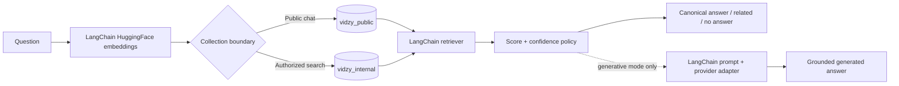

# Vidzy RAG

[](https://github.com/hussnainsheikh/vidzy-rag/actions/workflows/ci.yml)


[](LICENSE)

Vidzy RAG is a standalone, retrieval-first product knowledge application built with LangChain, Chroma, FastAPI, React, and local Sentence Transformers embeddings. By default it returns reviewed canonical answers without an external LLM; an optional generative mode can compose answers after retrieval. Public and private knowledge are stored in physically separate Chroma collections.

This repository is the RAG project root. It does not contain, depend on, or modify the original Vidzy product application.

## Highlights

- Retrieval-first public chat with reviewed, canonical answers.
- Local embeddings and persistent Chroma; no paid API or LLM key required.
- LangChain retrieval shared by deterministic and optional generative modes.
- FastAPI backend and a React/Vite static frontend.
- Physically separate `vidzy_public` and `vidzy_internal` collections.
- API-key-protected internal search; public chat cannot select private scope.
- Repeatable ingestion, retrieval evaluation, CI, and production deployment guidance.

## Why retrieval-first?

The default response path is deliberately small and auditable:

```text
Question → local embedding → Chroma → reviewed canonical answer
```

The closest canonical questions are retrieved semantically, then a confidence policy decides whether to return the reviewed answer, related results, or a safe no-answer response. This is predictable, inexpensive, and usable without external credentials. Generative mode keeps the same retrieval stage and adds an LLM afterward to compose a grounded response; it is optional and explicitly enabled.



## Architecture

- `api/app/config` — environment parsing and safe defaults.
- `api/app/embeddings` — process-cached `HuggingFaceEmbeddings`; one model instance per process.
- `api/app/ingestion` — heading-aware Markdown and JSONL loaders with deterministic IDs.
- `api/app/vectorstore` — LangChain Chroma integration and separate public/internal collections.
- `api/app/retrieval` — a LangChain `BaseRetriever` retaining Chroma relevance scores.
- `api/app/rag` — confidence policy and canonical answer selection.
- `api/app/generation` — provider factory and LangChain prompt; optional OpenAI adapter.
- `api/app/main.py` — FastAPI routes and compiled-SPA serving.
- `web` — React, Vite, and TypeScript static frontend.
- `evaluation` — labeled retrieval benchmark with no paid API dependency.

The public `/api/chat` route is hard-wired to the public collection and canonical-question document type. It cannot select the internal collection. `/api/search` permits public search without credentials; `internal` and `combined` scopes require `INTERNAL_API_KEY` via `X-Internal-API-Key`.

## Creating the knowledge base

Useful RAG systems start with evidence review, not vector storage. Source material is extracted into facts, validated, classified as public or private, and converted into canonical documentation and Q&A before LangChain ingestion. See [Building a knowledge base](docs/KNOWLEDGE_BASE.md) for the complete, tool-agnostic lifecycle and schemas.

## Use it with your own product

1. Clone this repository.
2. Replace or extend the reviewed Markdown under `knowledge/public/`.
3. Optionally add proprietary Markdown locally under the ignored `knowledge/internal/` directory.
4. Add reviewed canonical questions to `knowledge/metadata/questions.jsonl`.
5. Run knowledge validation and update the evaluation dataset.
6. Build the Chroma index.
7. Run the FastAPI service and React UI.

No second public repository is required. Keep private inputs ignored in the same working tree and transfer them to production through an approved private channel.

## Knowledge ingestion

Ingestion covers public/internal Markdown, canonical `questions.jsonl`, facts, and the source registry. Markdown is split on level-two headings, excluding evidence blocks from public searchable content. Metadata includes scope, category, status, IDs, tags, source fact IDs, document type, and source document where appropriate.

IDs are SHA-256 hashes of stable source identities. Reindexing replaces each collection before inserting the complete current snapshot, preventing duplicates and removing stale records.

```bash
python3 -m venv .venv
source .venv/bin/activate
pip install -r requirements.txt
cp .env.example .env
python -m api.app.ingestion.index
```

The first run downloads `sentence-transformers/all-MiniLM-L6-v2`. No embedding API or external LLM key is used.

## Run locally

Backend:

```bash
source .venv/bin/activate
uvicorn api.app.main:app --host 127.0.0.1 --port 8100 --workers 1
```

Frontend development server:

```bash
cd web
npm ci
npm run dev
```

Production-style static build:

```bash
cd web && npm run build && cd ..
uvicorn api.app.main:app --host 127.0.0.1 --port 8100 --workers 1
```

FastAPI serves `web/dist` at `/` when it exists. The Vite development server proxies `/api` to port 8100.

## API

Health:

```bash
curl http://127.0.0.1:8100/api/health
```

Public search:

```bash
curl -X POST http://127.0.0.1:8100/api/search \
  -H 'Content-Type: application/json' \
  -d '{"query":"What analytics does Vidzy provide?","scope":"public","limit":5}'
```

Internal search (never expose this key to the browser):

```bash
curl -X POST http://127.0.0.1:8100/api/search \
  -H 'Content-Type: application/json' \
  -H "X-Internal-API-Key: $INTERNAL_API_KEY" \
  -d '{"query":"private operational notes","scope":"internal","limit":5}'
```

Public chat:

```bash
curl -X POST http://127.0.0.1:8100/api/chat \
  -H 'Content-Type: application/json' \
  -d '{"message":"Can I show a CTA while my video is playing?"}'
```

Chat responses distinguish `direct_answer`, `related_results`, and `no_reliable_answer`. Public citations use curated labels, not repository implementation paths.

## Confidence strategy and evaluation

Chroma uses cosine distance with normalized embeddings; LangChain converts results to relevance scores. Chat considers the best canonical-question result, the gap to the runner-up, meaningful lexical support, and two configurable thresholds. The lexical check prevents a high-level semantic neighbor from becoming a false positive when it shares only generic product wording:

- `DIRECT_ANSWER_THRESHOLD` permits a canonical direct answer.
- `RELATED_RESULTS_THRESHOLD` separates potentially useful related results from a safe refusal.
- `AMBIGUITY_MARGIN` avoids selecting one answer when the top candidates are too close.

The benchmark contains exact questions, independently written paraphrases, terminology changes, ambiguous prompts, unrelated prompts, and product no-answer cases. It reports Top-1, Recall@3, Recall@5, rejection accuracy/false positives, and warm retrieval latency.

```bash
python -m evaluation.evaluate --output evaluation/results.local.json
```

Initial thresholds are deliberately configuration, not code constants hidden in the response service. See `evaluation/results.md` for the measured baseline used to select them.

## Retrieval and generative modes

Default:

```dotenv
RAG_RESPONSE_MODE=retrieval
```

Retrieval mode returns canonical reviewed answers and works with no LLM key. Merely adding `OPENAI_API_KEY` does not enable inference.

Optional generation:

```bash
pip install -r requirements-generative.txt
```

```dotenv
RAG_RESPONSE_MODE=generative
LLM_PROVIDER=openai
LLM_MODEL=gpt-4.1-mini
OPENAI_API_KEY=replace-me
LLM_FALLBACK_TO_RETRIEVAL=true
```

The adapter consumes the same retrieved public documents through a LangChain prompt. If the provider/package/key is unavailable, it falls back to canonical retrieval when configured. Provider-specific code is confined to the generation factory.

## Privacy model

| Scope | Source location | Git status | Chroma collection | Access |
| --- | --- | --- | --- | --- |
| Public | `knowledge/public/`, canonical Q&A | Tracked | `vidzy_public` | Public chat and search |
| Private | `knowledge/internal/`, optional local metadata | Ignored | `vidzy_internal` | API-key-protected search only |

Public `/api/chat` always retrieves canonical questions from `vidzy_public`; request input cannot switch it to the internal collection. Mixed-scope fact metadata and implementation provenance stay local when they contain private records or source paths.

Security controls include:

- Pydantic rejects unknown fields, invalid scopes, long prompts, and invalid limits.
- Internal/combined retrieval requires a constant-time API-key comparison.
- Public chat has no code path to the internal collection.
- Production disables interactive API docs and returns generic unexpected-error messages.
- CORS is allowlist-driven; no credentials are permitted cross-origin.
- Secrets come from environment variables and `.env` is ignored.
- The service logs error types, not request bodies or secret values.
- Request timeouts belong at Nginx and outbound provider adapters; the deployment example sets proxy timeouts.
- The stateless API is ready for an Nginx/edge rate limit without Redis. Add per-client limiting at the trusted proxy before internet launch.

`knowledge/public/` and `knowledge/metadata/questions.jsonl` are the publishable knowledge inputs. Organizations can place proprietary Markdown under the Git-ignored `knowledge/internal/` area and keep the mixed-scope `facts.jsonl` and provenance registry locally for development or production. These files remain on disk but must never be force-added to the public repository.

Public and private inputs are indexed into physically separate `vidzy_public` and `vidzy_internal` Chroma collections. Public chatbot retrieval is hard-wired to `vidzy_public`; the internal collection is reachable only through an internal or combined search request that passes the server-side API-key check.

The normal GitHub workflow is to review and stage the existing repository directly. [`scripts/create-public-release.sh`](scripts/create-public-release.sh) is an optional defense-in-depth audit utility for producing and inspecting a clean archive from a committed revision; it is not required, and it is not a second repository workflow.

See [SECURITY.md](SECURITY.md) for private vulnerability reporting and deployment assumptions.

## Tests and validation

```bash
source .venv/bin/activate
pytest
node scripts/knowledge/validate-knowledge.mjs
cd web && npm ci && npm run typecheck && npm run lint && npm run build
```

The knowledge validator treats original product-repository evidence paths as warnings in this standalone repository. Set `VALIDATE_ORIGINAL_SOURCES=true` only in an environment that also contains that original source tree.

GitHub Actions runs the same public-only checks on pushes and pull requests. Backend CI uses the actual local embedding implementation and caches the model between runs; it does not call a paid API, load private knowledge, or require an LLM key.

## Demo

A public deployment is planned; no live-demo URL is claimed yet. Reviewed screenshots can be added under [`docs/assets/`](docs/assets/README.md) as `chat.png` and `retrieval-debug.png`. Screenshots must show only public knowledge and sanitized diagnostics.

## Deployment design

The target topology is Nginx → `127.0.0.1:8100` → one Uvicorn worker → one embedding model → persistent Chroma. Examples are provided in `deploy/`; they do not modify system configuration.

The production checklist, exact commands, rollback procedure, and private-knowledge transfer boundary are documented in [`deploy/DEPLOYMENT.md`](deploy/DEPLOYMENT.md). The validated toolchain is Python 3.12 and Node 22; the frontend packages require Node 18.18 or newer.

For the current 1-vCPU/2-GB target:

- use exactly one Uvicorn worker;
- build the frontend ahead of time and serve its static assets from FastAPI;
- use persistent `CHROMA_PATH=/var/lib/vidzy-rag/chroma`;
- do not run a local generative model;
- index during deployment rather than on each application start;
- set `TOKENIZERS_PARALLELISM=false` if deployment profiling shows unnecessary thread contention.

The embedding model is lazy-loaded once per process. Health checks do not expose secrets, paths, keys, or private metadata.

On the local validation machine, the loaded Uvicorn process used approximately 429 MiB RSS after health, search, chat, and static-page requests. Clean indexing peaked at approximately 592 MiB RSS. Linux allocator behavior will differ, so production should still be monitored against the PM2 restart ceiling.

## Known limitations

- Retrieval quality is bounded by the Phase 1 corpus and compact local embedding model.
- Canonical response coverage is finite; low-confidence questions intentionally receive no answer.
- Ambiguous questions return related answers rather than merging claims.
- Chroma collection replacement is suitable for this single-process deployment but should be coordinated during a live reindex.
- The optional OpenAI adapter is disabled by default and requires separate dependencies.
- Before production, add trusted-proxy rate limiting, TLS, secret provisioning, backup/restore for Chroma, and an operational review of evaluation thresholds.

No production deployment is performed by this repository.

## Contributing and license

See [CONTRIBUTING.md](CONTRIBUTING.md) for setup, testing, pull-request, and privacy requirements. Changes and releases are recorded in [CHANGELOG.md](CHANGELOG.md).

Licensed under the [Apache License 2.0](LICENSE).
